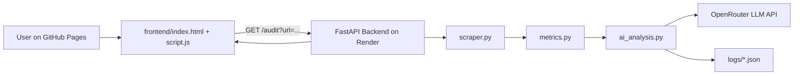

# AI Website Audit Tool

Production-ready, modular audit tool with:
- Python FastAPI backend (`backend/`)
- Static frontend for GitHub Pages (`frontend/`)
- Secure server-side LLM access via environment variables
- Prompt logging for traceability (`logs/`)

## Project Overview
Given a URL, the backend scrapes one page, computes factual metrics, sends compact structured input to an LLM, and returns:

```json
{
  "metrics": {"...": "..."},
  "ai_insights": {"...": "..."},
  "recommendations": [{"...": "..."}]
}
```

## Architecture Diagram



## Folder Structure

```
/
  backend/
    scraper.py
    metrics.py
    ai_analysis.py
    api.py
    utils/logs.py
    requirements.txt
    render.yaml
    .env.example
    .gitignore

  frontend/
    index.html
    script.js

  logs/
  README.md
```

## Backend: How It Works

### Scraping
- `backend/scraper.py` fetches the URL and extracts readable text.
- Uses `requests`, `beautifulsoup4`, and `readability-lxml` (with fallback behavior).

### Metrics Generation
- `backend/metrics.py` computes:
  - word count
  - heading counts (`H1`, `H2`, `H3`)
  - CTA count (buttons + action-like links)
  - internal vs external links
  - number of images
  - missing alt percentage
  - meta title + meta description

### AI Prompting Strategy
- `backend/ai_analysis.py` sends a compact structured payload to the LLM:
  - URL
  - computed metrics
  - short text excerpt
- Prompt is constrained to JSON-only output with required keys.
- Includes retry logic for truncated model responses.

### API
- `backend/api.py` exposes:
  - `GET /health`
  - `GET /audit?url=...` (for static frontend)
  - `POST /audit` (JSON body alternative)

### Prompt Logs
- `backend/utils/logs.py` stores:
  - `system_prompt`
  - `user_prompt`
  - `structured_model_input`
  - `raw_model_output`
- Files are written to root `logs/`.

## Secure Environment Handling

- API keys are read only on backend.
- No API key is ever used in frontend JavaScript.
- `.env` is gitignored.

Create backend env file:

```powershell
copy backend\.env.example backend\.env
```

Set values in `backend/.env`:

```env
OPENROUTER_API_KEY=your_openrouter_api_key_here
OPENROUTER_MODEL=openai/gpt-4.1-mini
OPENROUTER_MAX_TOKENS=420
OPENROUTER_RETRY_MAX_TOKENS=700
OPENROUTER_TEMPERATURE=0.1
AUDIT_LOGS_DIR=../logs
```

## Run Backend Locally

```powershell
py -m venv .venv
.venv\Scripts\Activate.ps1
pip install -r backend\requirements.txt
uvicorn backend.api:app --reload --host 0.0.0.0 --port 8000
```

Test endpoint:

```bash
curl "http://127.0.0.1:8000/audit?url=https://example.com"
```

## Deploy Backend on Render

This project includes `backend/render.yaml` with:
- Python environment
- Build command: `pip install -r requirements.txt`
- Start command: `uvicorn api:app --host 0.0.0.0 --port $PORT`
- Environment variable placeholders

Steps:
1. Push repo to GitHub.
2. In Render, create a new Blueprint deployment.
3. Point to `backend/render.yaml`.
4. Set secret env var `OPENROUTER_API_KEY` in Render dashboard.
5. Deploy.

## Deploy Frontend on GitHub Pages

Frontend is fully static in `frontend/`.

Steps:
1. In GitHub, go to repository settings.
2. Open Pages settings.
3. Select source branch and folder containing `frontend/` (or publish that folder via workflow).
4. Edit `frontend/script.js` and set:

```js
const BACKEND_BASE_URL = "https://YOUR-RENDER-APP.onrender.com";
```

5. Save, commit, and republish.

## Frontend Notes
- No server-side logic in frontend.
- No API keys in frontend.
- Calls backend only via:
  - `GET https://YOUR-RENDER-APP.onrender.com/audit?url=...`

## Improvements (Next Iteration)
- Add per-domain caching to reduce repeated LLM calls.
- Add async task queue for long pages.
- Add schema validation for AI output with stricter guarantees.
- Add automated tests for metrics extraction and API contract.
- Add rate limiting and URL validation hardening.
